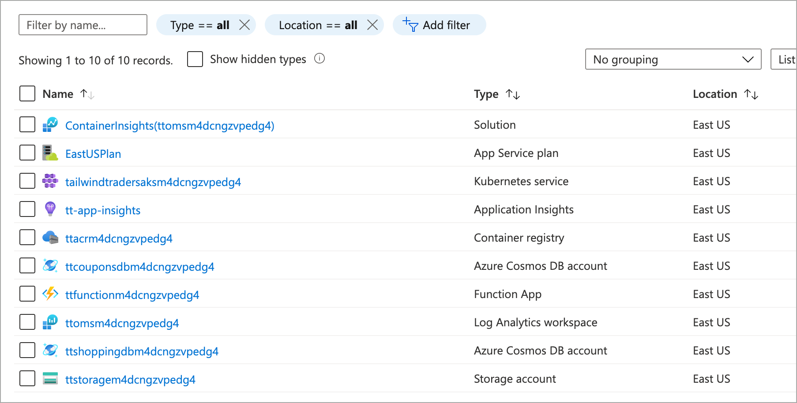

# Azure Well Architected Framework Sample (ARM Template)

This Azure Resource Manager (ARM) template sample deploys all back end service for the tailwindtraders.com website. Note, this template does not deploy the tailwindtrader.com application itself. If you are interested in deploying tailwindtraders.com, see https://github.com/microsoft/TailwindTraders.

## Prerequisites

To deploy this ARM template, you will need an Azure Service Principal. For information on creating a service principal, see [Create an Azure Service Principle with the Azure CLI](https://docs.microsoft.com/cli/azure/create-an-azure-service-principal-azure-cli?view=azure-cli-latest).

## Azure portal

To deploy this template using the Azure portal, click this button.

<a href="https://portal.azure.com/#create/Microsoft.Template/uri/https%3A%2F%2Fraw.githubusercontent.com%2Fpnp%2Fsample%2Fmaster%2Fazuredeploy.json" target="_blank">
    
</a>

## Azure CLI

To use the Azure CLI, run the following commands for the root of this repository. Replace the `servicePrincipalId` and `servicePrincipalSecret` values with your service principal credentials.

```azurecli
az group create --name waf-tempalte-sample --location eastus

az deployment group create --template-file ./OperationslExcellence/IACSample/azuredeploy.json --resource-group waf-tempalte-sample --parameters servicePrincipalId=<appid> servicePrincipalSecret=<password>
```

Once done, the following resource will have been deployed to your Azure Subscription.

