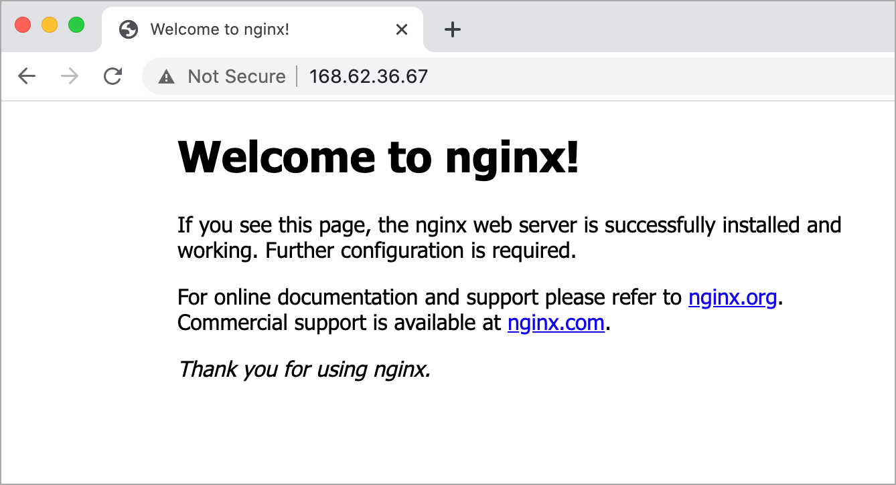

# Azure Well Architected Framework Sample ARM Template

This Azure Resource Manager (ARM) template sample deploys an Ubuntu virtual machine and uses the custom script extension to install Nginx on the VM.

## Deploy the template

The ARM tempalte can be deployed in many differnt ways. To use the Azure portal, click this button:

<a href="https://portal.azure.com/#create/Microsoft.Template/uri/https%3A%2F%2Fraw.githubusercontent.com%2Fmspnp%2Fsamples%2Fmaster%2FOperationalExcellence%2FScriptExtension%2Fazuredeploy.json" target="_blank">
    
</a>

To use the Azure CLI, run the following commands for the root of this repository.

```azurecli
az group create --name boot-strap-script-extension --location eastus

az deployment group create --template-file ./OperationalExcellence/ScriptExtension/azuredeploy.json --resource-group boot-strap-script-extension --parameters adminUserName=adminuser adminPassword=Password2020!
```

Once done, the following resource will have been deployed to your Azure Subscription.


Browse to the public IP address of the virtual machine to verify that Nginx has been installed.

