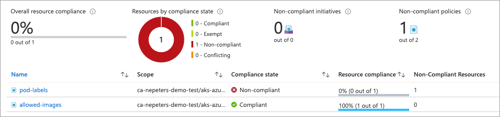

--- 
page_type: sample
languages:
- azurecli
products:
- azure
- azure-kubernetes-service
---

# Azure Well Architected Framework Sample (Secure AKS Cluster Pods with Azure Policy)

Azure Policy extends Gatekeeper v3, an admission controller webhook for Open Policy Agent (OPA), to apply at-scale enforcements and safeguards on your clusters in a centralized, consistent manner. Azure Policy makes it possible to manage and report on the compliance state of your Kubernetes clusters from one place.

In this sample, an AKS cluster is deployed, a policy applied to the cluster that only allows specific images to run in the cluster, and some steps are detailed that you can follow to experience Azure Policy protected AKS cluster.

## Deploy sample

**Azure portal**

To deploy this template using the Azure portal, click this button.

<br />

<a href="https://portal.azure.com/#create/Microsoft.Template/uri/https%3A%2F%2Fraw.githubusercontent.com%2Fneilpeterson%2Fsamples%2Fazure-function-powershell%2FOperationalExcellence%2Fazure-aks-policy%2Fazuredeploy.json" target="_blank">
    
</a>  

**Azure CLI**

Create a resource group for the deployment.

```azurecli
az group create --name aks-azure-policy --location eastus
```

Run the following command to initiate the deployment.

```azurecli
az deployment group create \
    --resource-group aks-azure-policy \
    --template-uri https://raw.githubusercontent.com/neilpeterson/samples/aks-azure-policy/OperationalExcellence/azure-aks-policy/azuredeploy.json
```

Verify that policies have propagated to the cluster. This process could take up to 20 minutes.

```azurecli
$ kubectl get constrainttemplate

NAME                             AGE
k8sazurecontainerallowedimages   34s
k8sazurepodenforcelabels         33s
```

If you would like to run the command on a loop to visually indicate when policies have propagated down to the cluster, run the following command.

```azurecli
while $true; do kubectl get constrainttemplate; sleep 5; done
```

## Policies

Two policies have been applied to the AKS cluster with this deployment. With these policies, you can only run pods that match the image specified during deployment. Any other pod / image combination is denied. You do not need to add the appropriate label; however, the pod label policy will return as non-compliant, which you will see in the demo.

| Policy Description | Details | Effect | 
|---|---|---|
| Ensure only allowed container images in the Kubernetes cluster. | Default = nginx, can be changed at deployment time. | Deny |
| Enforce labels on pods in the Kubernetes cluster. | DemoLabel = Demo | Audit |

## Demo the solution

Create a pod using the `Ubuntu` image.

```azurecli
kubectl run ubuntu --generator=run-pod/v1 --image ubuntu
```
Take note that this has been denied by the policy.

```
Error from server ([denied by azurepolicy-container-allowed-images-1f8eb52bcdec7549c616] Container image ubuntu for container ubuntu has not been allowed.): admission webhook "validation.gatekeeper.sh" denied the request: [denied by azurepolicy-container-allowed-images-1f8eb52bcdec7549c616] Container image ubuntu for container ubuntu has not been allowed.
```

Create a pod using the `nginx` image. Because _nginx_ has been designated as an acceptable image, the pod is successfully created.

```azurecli
kubectl run nginx --generator=run-pod/v1 --image nginx
```

After some time has passed, browse to Azure Portal > Policy > Compliance. Here you will see that the pod-labels policy is non-compliant.



## Code of conduct

This project has adopted the [Microsoft Open Source Code of Conduct](https://opensource.microsoft.com/codeofconduct/). For more information, see the [Code of Conduct FAQ](https://opensource.microsoft.com/codeofconduct/faq/) or contact [opencode@microsoft.com](mailto:opencode@microsoft.com) with any additional questions or comments.