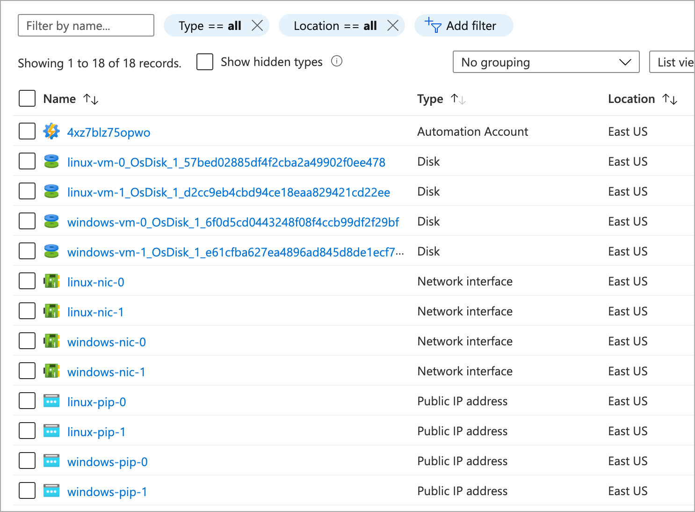
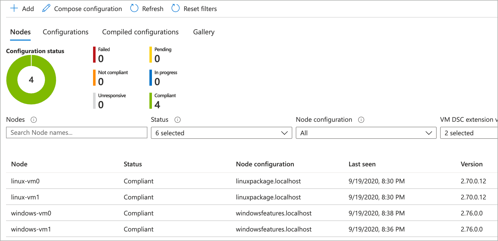
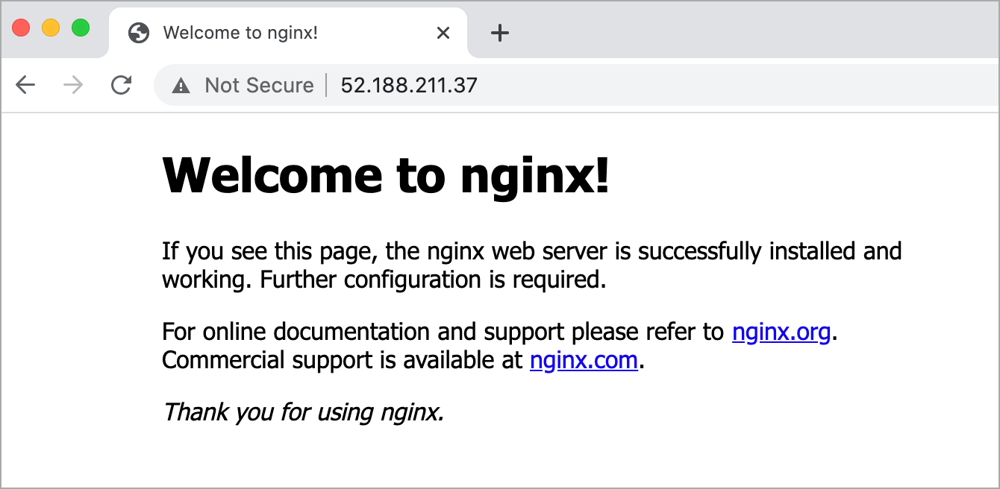

# Azure Well Architected Framework Sample (State Configuration)

These Azure Resource Manager (ARM) template samples deploy an Azure Automation account and imports / compiles two PowerShell Desired State Configuration scripts. The template then deploys 1 to many virtual machines (Windows and Linux), onboards them into Azure Automation State Configuration, which then uses the compiled configurations to install a webserver on each of the virtual machines.

The deployment is broken down into several ARM templates.

| File name | Description |
|---|---|
| **azuredeploy.json** | Main template responsible for deploying all other templates. |
| **azuredeploy-state-congif.json** | Deploys Azure Automation, imports the DSC resource for Linux DSC modules, imports and compiles two DSC configuration into Azure Automation State Configuration. |
| **azuredeploy-virtual-network.json** | Deploys an Azure Virtual Network. |
| **azure-deploy-windows-vm.json** | Creates 1 to many Windows virtual machines and onboard them into Azure Automation State Configuration. |
| **azure-deploy-linux-vm.json** | Creates 1 to many Linux virtual machines and onboard them into Azure Automation State Configuration. |

## Deploy sample

### Azure portal

To deploy this template using the Azure portal, click this button.  


<a href="https://portal.azure.com/#create/Microsoft.Template/uri/https%3A%2F%2Fraw.githubusercontent.com%2Fmspnp%2Fsamples%2Fmaster%2FOperationalExcellence%2Fazure-automation-state-configuration%2Fazuredeploy.json" target="_blank">
    
</a>

### Azure CLI

Clone the samples repository.

```azurecli
git clone https://github.com/mspnp/samples.git
```

Create a resource group for the deployment.

```azurecli
az group create --name state-config-demo --location eastus
```

Run the following command to initiate the deployment. If you would like to adjust the number of virtual machines deployed, update the *windowsVMCount* and *linuxVMCount* values.

```azurecli
az deployment group create \
    --template-file ./samples/OperationalExcellence/azure-automation-state-configuration/azuredeploy.json \
    --resource-group state-config-demo \
    --parameters adminUserName=azureadmin adminPassword=Password2020! windowsVMCount=2 linuxVMCount=2
```

Once done, the following resource will have been deployed to your Azure Subscription (partial list).



Click on the **Automation Account** resource and then **State configuration (DSC)** and notice that all virtual machines have been added to the system and are compliant. These machines have all had the PowerShell DSC configuration applied, which has installed a web server on each.



Browse to the public IP address of any virtual machine to verify that a web server is running.



---

This project has adopted the [Microsoft Open Source Code of Conduct](https://opensource.microsoft.com/codeofconduct/). For more information see the [Code of Conduct FAQ](https://opensource.microsoft.com/codeofconduct/faq/) or contact [opencode@microsoft.com](mailto:opencode@microsoft.com) with any additional questions or comments.
