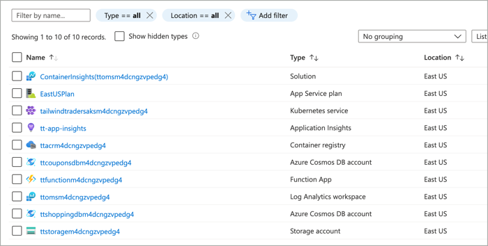

# Azure Well Architected Framework Sample (ARM Template)

This Azure Resource Manager (ARM) template sample deploys all back end service for the tailwindtraders.com website. Note, this template does not deploy the tailwindtrader.com application itself. If you are interested in deploying tailwindtraders.com, see https://github.com/microsoft/TailwindTraders.

## Prerequisites

To deploy this ARM template, you will need an Azure Service Principal. For information on creating a service principal, see [Create an Azure Service Principle with the Azure CLI](https://docs.microsoft.com/cli/azure/create-an-azure-service-principal-azure-cli?view=azure-cli-latest).

## Deploy sample

**Azure portal**

To deploy this template using the Azure portal, click this button.  

<br />

<a href="https://portal.azure.com/#create/Microsoft.Template/uri/https%3A%2F%2Fraw.githubusercontent.com%2Fmspnp%2Fsamples%2Fmaster%2FOperationalExcellence%2Finfrastructure-as-code%2Fazuredeploy.json" target="_blank">
    
</a>  

**Azure CLI**

Clone the samples repository.

```azurecli
git clone https://github.com/mspnp/samples.git
```

Create a resource group for the deployment.

```azurecli
az group create --name waf-tempalte-sample --location eastus
```

Run the following command to initiate the deployment. Replace the `servicePrincipalId` and `servicePrincipalSecret` values with your service principal credentials.

```azurecli
az deployment group create \
    --template-file ./samples/OperationalExcellence/infrastructure-as-code/azuredeploy.json \
    --resource-group waf-tempalte-sample \
    --parameters servicePrincipalId=<appid> servicePrincipalSecret=<password>
```

Once done, the following resource will have been deployed to your Azure Subscription.



## Microsoft Open Source Code of Conduct

This project has adopted the [Microsoft Open Source Code of Conduct](https://opensource.microsoft.com/codeofconduct/).

Resources:

- [Microsoft Open Source Code of Conduct](https://opensource.microsoft.com/codeofconduct/)
- [Microsoft Code of Conduct FAQ](https://opensource.microsoft.com/codeofconduct/faq/)
- Contact [opencode@microsoft.com](mailto:opencode@microsoft.com) with questions or concerns