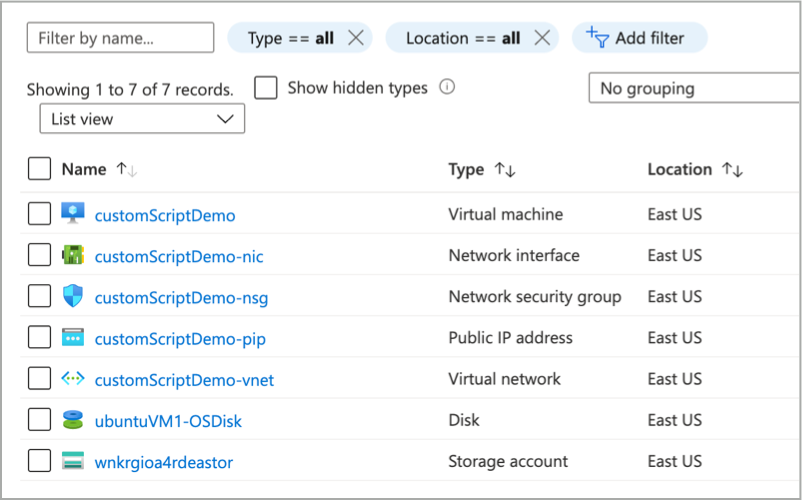
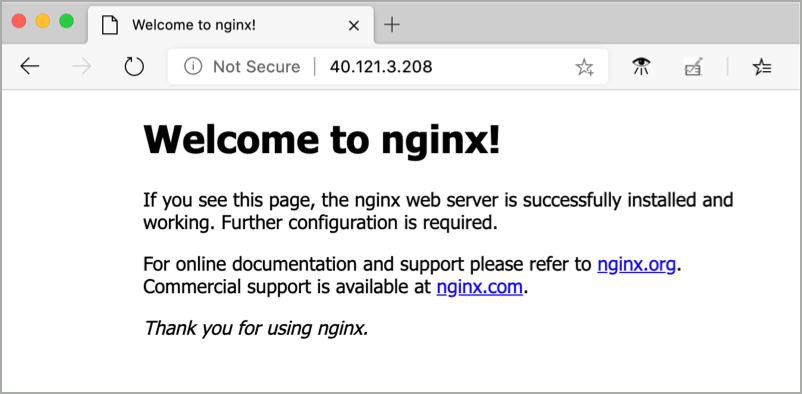

--- 
page_type: sample
languages:
- azurecli
products:
- azure
---

# Azure Well Architected Framework Sample (Custom Script Extension)

This Azure Resource Manager (ARM) template sample deploys an Ubuntu virtual machine and uses the custom script extension to install Nginx on the VM.

## Deploy sample

### Azure portal

To deploy this template using the Azure portal, click this button.  

<br />

<a href="https://portal.azure.com/#create/Microsoft.Template/uri/https%3A%2F%2Fraw.githubusercontent.com%2Fmspnp%2Fsamples%2Fmaster%2FOperationalExcellence%2Fscript-extension%2Fazuredeploy.json" target="_blank">
    
</a>  

### Azure CLI

Clone the samples repository.

```azurecli
git clone https://github.com/mspnp/samples.git
```

Create a resource group for the deployment.

```
az group create --name boot-strap-script-extension --location eastus
```

Run the following command to initiate the deployment.

```azurecli
az deployment group create \
    --template-file ./samples/OperationalExcellence/script-extension/azuredeploy.json \
    --resource-group boot-strap-script-extension \
    --parameters adminUserName=adminuser adminPassword=Password2020!
```

Once done, the following resource will have been deployed to your Azure Subscription.



Browse to the public IP address of the virtual machine to verify that Nginx has been installed.



---

This project has adopted the [Microsoft Open Source Code of Conduct](https://opensource.microsoft.com/codeofconduct/). For more information see the [Code of Conduct FAQ](https://opensource.microsoft.com/codeofconduct/faq/) or contact [opencode@microsoft.com](mailto:opencode@microsoft.com) with any additional questions or comments.
