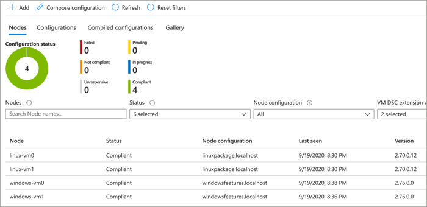
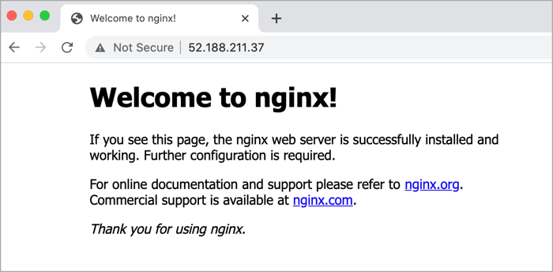

# Azure Automation State Configuration

These Azure Resource Manager (ARM) template samples deploy an Azure Automation account and imports / compiles two PowerShell Desired State Configuration scripts. The template then deploys 1 to many virtual machines (Windows and Linux), onboards them into Azure Automation State Configuration, which then uses the compiled configurations to install a webserver on each of the virtual machines. See [Azure Automation State Configuration](https://learn.microsoft.com/azure/architecture/example-scenario/state-configuration/state-configuration) on the Azure Architecture Center for more context.

## Deploy sample

Create a resource group for the deployment.

```azurecli-interactive
az group create --name state-configuration --location eastus
```

Run the following command to initiate the deployment. If you would like to adjust the number of virtual machines deployed, update the *windowsVMCount* and *linuxVMCount* values.

```azurecli
az deployment group create --resource-group state-configuration \
    --template-uri https://raw.githubusercontent.com/mspnp/samples/main/solutions/azure-automation-state-configuration/azuredeploy.json
```

Once complete, click on the **Automation Account** resource and then **State configuration (DSC)** and notice that all virtual machines have been added to the system and are compliant. These machines have all had the PowerShell DSC configuration applied, which has installed a web server on each.



Browse to the public IP address of any virtual machine to verify that a web server is running.



## Solution deployment parameters

| Parameter | Type | Description | Default |
|---|---|---|--|
| adminUserName | string | If deploying virtual machines, the admin user name. | null |
| adminPassword | securestring | If deploying virtual machines, the admin password. | null |
| windowsVMCount | int | Number of Windows virtual machines to create in spoke network. | 0 |
| linuxVMCount | int | Number of Linux virtual machines to create in spoke network. | 1 |
| vmSize | string | Size for the Windows and Linux virtual machines. | Standard_A1_v2 |
| windowsConfiguration | object | DSC configuration details for the Windows virtual machines. | name, description, script |
| linuxConfiguration | object | DSC configuration details for the Linux virtual machines. | name, description, script |
| virtualNetworkName | string | Name for the virtual network. | virtial-network|
| addressPrefix | string | Address prefix for the virtual network. | 10.0.0.0/16 |
| subnetPrefix | string | Address prefix for the subnet. | 10.0.0.0/24 |
| subnetName | string | Name for the subnet. | subnet |
| location | string | Deployment location. | resourceGroup().location | 

## Microsoft Open Source Code of Conduct

This project has adopted the [Microsoft Open Source Code of Conduct](https://opensource.microsoft.com/codeofconduct/).

Resources:

- [Microsoft Open Source Code of Conduct](https://opensource.microsoft.com/codeofconduct/)
- [Microsoft Code of Conduct FAQ](https://opensource.microsoft.com/codeofconduct/faq/)
- Contact [opencode@microsoft.com](mailto:opencode@microsoft.com) with questions or concerns
