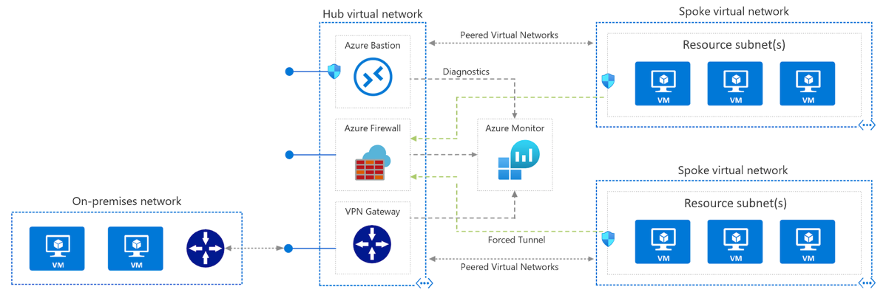

# Hub and spoke deployment

| Deployment | Status |
|---|---|
| ARM Template | [](https://ceapex.visualstudio.com/pnp/_build/latest?definitionId=3727&branchName=master) |
| Bicep Template | [](https://ceapex.visualstudio.com/pnp/_build/latest?definitionId=3729&branchName=master) |


This sample deploys Azure virtual networks in a hub and spoke configuration. An Azure Firewall and Bastion host are also deployed. Optionally, a VPN gateway and sample workload (virtual machines) can be deployed. 

Where applicable, each resource is configured to send diagnostics to an Azure Log Analytics instance.



For detailed information, see the Azure Hub and Spoke reference architecture:

> [!div class="nextstepaction"]
> [Hub and spoke reference architecture](https://docs.microsoft.com/azure/architecture/reference-architectures/hybrid-networking/hub-spoke)

## Deploy sample

Create a resource group for the deployment.

```azurecli-interactive
az group create --name hub-spoke --location eastus
```

**Basic deployment**

Run the following command to initiate the deployment. If you would like to also deploy this sample with virtual machines and / or an Azure VPN gateway, see the `az deployment group create` examples found later in this document.

```azurecli-interactive
az deployment group create \
    --resource-group hub-spoke \
    --template-uri https://raw.githubusercontent.com/mspnp/samples/master/solutions/azure-hub-spoke/azuredeploy.json
```

**Deploy with virtual machines**

Run the following command to initiate the deployment with a Linux VM deployed to the first spoke network.

```azurecli-interactive
az deployment group create \
    --resource-group hub-spoke \
    --template-uri https://raw.githubusercontent.com/mspnp/samples/master/solutions/azure-hub-spoke/azuredeploy.json \
    --parameters adminPassword=Password2020! linuxVMCount=1 windowsVMCount=1
```

**Deploy with VPN gateway**

Run the following command to initiate the deployment with a Linux VM deployed to the first spoke network and a virtual network gateway deployed into the hub virtual network.

```azurecli-interactive
az deployment group create \
    --resource-group hub-spoke \
    --template-uri https://raw.githubusercontent.com/mspnp/samples/master/solutions/azure-hub-spoke/azuredeploy.json \
    --parameters adminPassword=Password2020! linuxVMCount=1 windowsVMCount=1 deployVpnGateway=true
```

## Solution deployment parameters

| Parameter | Type | Description | Default |
|---|---|---|--|
| windowsVMCount | int | Number of Windows virtual machines to create in spoke network. | 0 |
| linuxVMCount | int | Number of Linux virtual machines to create in spoke network. | 0 |
| adminUserName | string | If deploying virtual machines, the admin user name. | null |
| adminPassword | securestring | If deploying virtual machines, the admin password. | null |
| deployVpnGateway | bool | If true, a virtual network gateway is deployed into the hub network (30 min deployment). | false |
| hubNetwork | object | Network configuration for the hub virtual network. | [see template] |
| spokeOneNetwork | object | Network configuration for the first spoke virtual network. | [see template] |
| spokeTwoNetwork | object | Network configuration for the second spoke virtual network. | [see template] |
| vpnGateway | object | Network configuration for the vpn gateway. | [see template] |
| bastionHost | object | Configuration for the Bastion host. | [see template] |
| azureFirewall | object | Network configuration for the firewall instance. | [see template] |
| location | string | Deployment location. | resourceGroup().location | 

## Diagnostic configurations

The following resources are configured to send diagnostic logs to the included Log Analytics workspace.

- All virtual networks
- All network security groups
- Azure VPN Gateway
- Azure Firewall
- Azure Bastion

Note, this deployment includes optional virtual machines. These are not configured with a Log Analytics workspace, however, can be with the Log Analytics virtual machine extension for [Windows](https://docs.microsoft.com/azure/virtual-machines/extensions/oms-windows) and [Linux](https://docs.microsoft.com/azure/virtual-machines/extensions/oms-linux).

## Microsoft Open Source Code of Conduct

This project has adopted the [Microsoft Open Source Code of Conduct](https://opensource.microsoft.com/codeofconduct/).

Resources:

- [Microsoft Open Source Code of Conduct](https://opensource.microsoft.com/codeofconduct/)
- [Microsoft Code of Conduct FAQ](https://opensource.microsoft.com/codeofconduct/faq/)
- Contact [opencode@microsoft.com](mailto:opencode@microsoft.com) with questions or concerns
