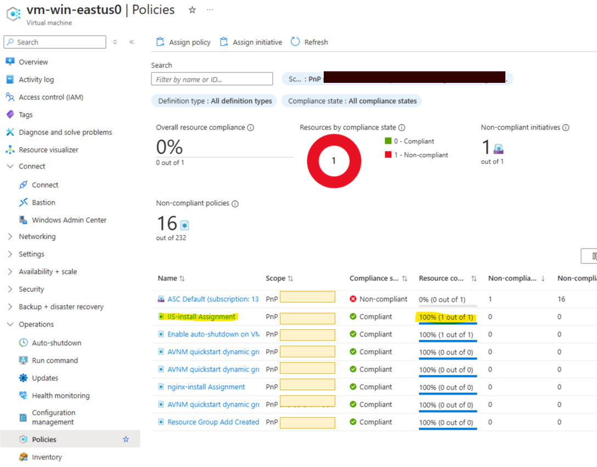

# Azure Machine Configuration

This sample deploys an [Azure Machine Configuration](https://learn.microsoft.com/azure/governance/machine-configuration/) scenario, and it will compile PowerShell Desired State Configuration scripts. The Bicep template then deploys 1 to many virtual machines (Windows and Linux), which then uses the compiled configurations to install a webserver on each of the virtual machines.  

Azure Machine Configuration enables you to audit and enforce configuration settings on both Azure and hybrid (Arc-enabled) machines using code. It leverages PowerShell Desired State Configuration (DSC) to define the desired state of a system and ensures compliance through Azure Policy. It supports custom configuration packages and provides detailed compliance reporting through Azure Resource Graph.  

The main difference between Azure Machine Configuration and Azure Automation State Configuration lies in their architecture and integration. Azure Automation State Configuration relies on Azure Automation accounts and DSC pull servers. In contrast, Azure Machine Configuration is fully integrated into Azure Resource Manager and Azure Policy, eliminating the need for separate automation infrastructure. It supports direct assignment of configurations, multiple configurations per machine, and more granular remediation controls. 

## Deploy bases

  Azure Command-Line Interface is required
  The repository need to be clone
  ```bash
    git clone https://github.com/mspnp/samples.git
    cd ./solutions/azure-machine-configuration
  ```

### Create a resource group for the deployment.

```bash
  az group create --name rg-machine-configuration-eastus --location eastus
```

### Deploy storage Account and User Manage Identity
To deploy a custom guest configuration policy in Azure, a Storage Account is required to host the .zip package that contains the compiled .mof file, metadata, and any required DSC resources. This storage location allows Azure Policy to access and distribute the configuration package to target machines.  
Azure Storage requires access via RBAC. This script assigns the necessary roles to the current user to enable file uploads.

```bash
  CURRENT_USER_OBJECT_ID=$(az ad signed-in-user show -o tsv --query id)
  STORAGE_ACCOUNT_NAME="stpolices$(LC_ALL=C tr -dc 'a-z0-9' < /dev/urandom | fold -w 7 | head -n 1)"
  az deployment group create --resource-group rg-machine-configuration-eastus --template-file ./bicep/storage_account.bicep  -p storageAccountName=$STORAGE_ACCOUNT_NAME principalId=$CURRENT_USER_OBJECT_ID

  POLICY_USER_ASSIGNED_IDENTITY=$(az deployment group show --resource-group rg-machine-configuration-eastus --name storage_account --query "properties.outputs.policyUserAssignedIdentityId.value" --output tsv)
```

## Azure Policy Creation
Custom policies using DSC in Azure are built on the Guest Configuration framework, which allows administrators to define and enforce configuration baselines across Windows and Linux machines. These policies are authored using PowerShell DSC resources and compiled into MOF (Managed Object Format) files. The process typically involves creating a DSC resource, defining a configuration, compiling it, and packaging it into a ZIP file. This package is then published and assigned as an Azure Policy. Azure Policy evaluates the configuration against the target machines and reports compliance.  

It section requires:
* PowerShell 7 is required for authoring and compiling DSC configurations
* PSDscResources: This module contains a collection of commonly used DSC resources.
* GuestConfiguration: This module is used to create and manage guest configuration packages and policies. It includes cmdlets like New-GuestConfigurationPolicy and Get-GuestConfigurationPackageComplianceStatus
* Az.Resources for commands like New-AzPolicyDefinition, New-AzPolicyAssignment
* Az.Accounts. Required for authentication and context management. Use Connect-AzAccount and Set-AzContext to authenticate and select the correct subscription 
* Nxtools module to compile the linux Script

```powershell
  cd scripts
```

### Create mof files

We have the DSC script for linux and Windows and we are going to execute the PowerShell scripts.
A MOF file (Managed Object Format) is a compiled output of a PowerShell Desired State Configuration (DSC) script that defines the desired state of a system. It contains the configuration instructions in a standardized format that can be interpreted by the Local Configuration Manager (LCM) on a target machine to enforce or audit system settings.

```powershell
  ./linux-config.ps1   # It will generate ./NginxInstall/localhost.mof
  ./windows-config.ps1 # It will generate ./windowsfeatures/localhost.mof
```
### Package Configuration 
The New-GuestConfigurationPackage cmdlet is used to create a guest configuration package from a compiled .mof file, which defines the desired state of a system using PowerShell DSC. This package is then used to audit or enforce configuration compliance on Azure or Arc-enabled machines through Azure Policy.
The expected output is a .zip package that includes the .mof, metadata, and any required DSC resources, ready to be published and assigned as a custom policy in Azure.

```powershell
  ./linux-package.ps1   # It will generate ./NginxInstall.zip
  ./windows-package.ps1 # It will generate ./WindowsFeatures.zip
```

### Upload configurations to Azure Storage
The package must be published.

```bash
 az storage blob upload --account-name $STORAGE_ACCOUNT_NAME --container-name windowsmachineconfiguration --file ./scripts/NginxInstall.zip --auth-mode login  --overwrite

 az storage blob upload --account-name $STORAGE_ACCOUNT_NAME --container-name windowsmachineconfiguration --file ./scripts/WindowsFeatures.zip --auth-mode login  --overwrite
 
URL_LX_CONTENT="https://$STORAGE_ACCOUNT_NAME.blob.core.windows.net/windowsmachineconfiguration/NginxInstall.zip"
echo $URL_LX_CONTENT

URL_WIN_CONTENT="https://$STORAGE_ACCOUNT_NAME.blob.core.windows.net/windowsmachineconfiguration/WindowsFeatures.zip"
echo $URL_WIN_CONTENT
```
### Generate Policies
On linux-policy.ps1, change the ContentUri for the content of $URL_LX_CONTENT and ManagedIdentityResourceId by $POLICY_USER_ASSIGNED_IDENTITY  
On windows-policy.ps1, change the ContentUri for the content of $URL_WIN_CONTENT and ManagedIdentityResourceId by $POLICY_USER_ASSIGNED_IDENTITY  

```powershell
   # Generate Policy Definition
  ./linux-policy.ps1   # It will generate the policy definition at .\policies\auditIfNotExists\NginxInstall_DeployIfNotExists.json
  ./windows-policy.ps1 # It will generate the policy definition at .\policies\auditIfNotExists\WindowsFeatures_DeployIfNotExists.json

  # Deploy Policies
  New-AzPolicyDefinition -Name 'nginx-install' -Policy ".\policies\auditIfNotExists\NginxInstall_DeployIfNotExists.json"
  New-AzPolicyDefinition -Name 'IIS-install' -Policy ".\policies\auditIfNotExists\WindowsFeatures_DeployIfNotExists.json"
```

### Assign Policies
Assign the policy to work aganst any virtual machine in our resoruce group. 

The Guest Configuration Resource Contributor role is needed to be assigned on the User Assigned Identitty, it allows the identity to:
* Write guest configuration assignments.  
* Read and report compliance data from virtual machines.  
* Deploy the Guest Configuration extension if needed.  

Contributor Role (optional but common): Grants broad permissions including the ability to create and manage resources, which may be necessary depending on what the policy does.  

This is critical because Azure Policy uses this identity to enforce and monitor the guest configuration on target machines. Without this role, the policy assignment may succeed, but the guest configuration won't be applied or reported correctly.

```powershell
$ResourceGroup = Get-AzResourceGroup -Name rg-machine-configuration-eastus
$UserAssignedIdentity = Get-AzUserAssignedIdentity -ResourceGroupName rg-machine-configuration-eastus -Name 'identity-eastus'

$policyDefinitionNginxInstall = Get-AzPolicyDefinition -Name 'nginx-install'
New-AzPolicyAssignment -Name 'nginx-install' -DisplayName "nginx-install Assignment" -Scope $ResourceGroup.ResourceId  -PolicyDefinition $policyDefinitionNginxInstall -Location 'eastus' -IdentityType 'UserAssigned' -IdentityId $UserAssignedIdentity.Id

$policyDefinitionWin = Get-AzPolicyDefinition -Name 'IIS-install'
New-AzPolicyAssignment -Name 'IIS-install' -DisplayName "IIS-install Assignment" -Scope $ResourceGroup.ResourceId  -PolicyDefinition $policyDefinitionWin -Location 'eastus' -IdentityType 'UserAssigned' -IdentityId $UserAssignedIdentity.Id

# Go back to root folder
cd..
```

## Deploy sample

Run the following command to initiate the deployment. If you would like to adjust the number of virtual machines deployed, update the *windowsVMCount* and *linuxVMCount* values.  

To apply policies using Azure Machine Configuration, the virtual machine must have the Guest Configuration extension installed and be enabled with a system-assigned managed identity, which allows it to authenticate and interact securely with the configuration service to download and enforce policy assignments.  

To successfully download the Desired State Configuration (DSC), the virtual machine must be assigned the policy user-assigned managed identity that has the Storage Blob Data Reader role.

```bash
az deployment group create --resource-group rg-machine-configuration-eastus -f ./bicep/main.bicep -p policyUserAssignedIdentityId=$POLICY_USER_ASSIGNED_IDENTITY
```
## Check Policy download
The solution has Azure Bastion deployed. You can log in to the Azure VM and inspect the Guest Extension.

Here where are the [client Guest Configuration log](https://learn.microsoft.com/azure/governance/machine-configuration/overview#client-log-files) file for more details.  

Within the GuestConfig/Configuration folder, you should find the downloaded policies.   

## Monitoring 
Each virtual machine includes visibility into the Azure Policies applied to it, along with its current compliance status, enabling users to track and manage configuration adherence effectively.  

  

It is possible view the general compliant situation on Policies  

  

In this view is possible to see our Policies definition and assigments  

   
  


It could take hours to detect the issue, remediate and be complaint. After that you could check using the VM public ip and call it in a browser.  

  


## Solution deployment parameters

| Parameter | Type | Description | Default |
|---|---|---|--|
| adminUserName | string | If deploying virtual machines, the admin user name. | admin-user |
| adminPassword | securestring | If deploying virtual machines, the admin password. | null |
| windowsVMCount | int | Number of Windows virtual machines to create in spoke network. | 1 |
| linuxVMCount | int | Number of Linux virtual machines to create in spoke network. | 1 |
| vmSize | string | Size for the Windows and Linux virtual machines. | Standard_A4_v2 |
| location | string | Deployment location. | resourceGroup().location |

## Clean Up

```bash
az group delete -n rg-machine-configuration-eastus  -y

az policy definition delete --name nginx-install

az policy definition delete --name IIS-install

```

## Microsoft Open Source Code of Conduct

This project has adopted the [Microsoft Open Source Code of Conduct](https://opensource.microsoft.com/codeofconduct/).

Resources:

- [Microsoft Open Source Code of Conduct](https://opensource.microsoft.com/codeofconduct/)
- [Microsoft Code of Conduct FAQ](https://opensource.microsoft.com/codeofconduct/faq/)
- Contact [opencode@microsoft.com](mailto:opencode@microsoft.com) with questions or concerns
