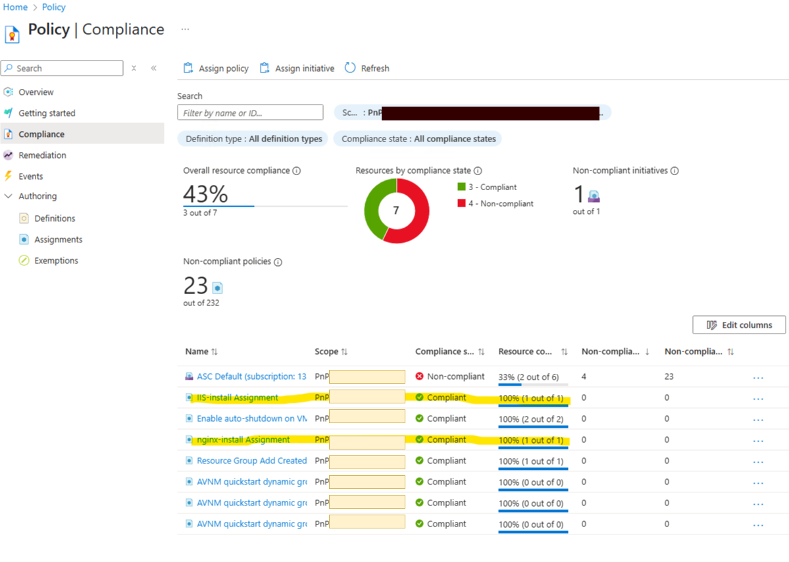
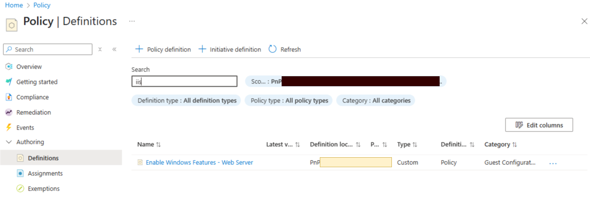
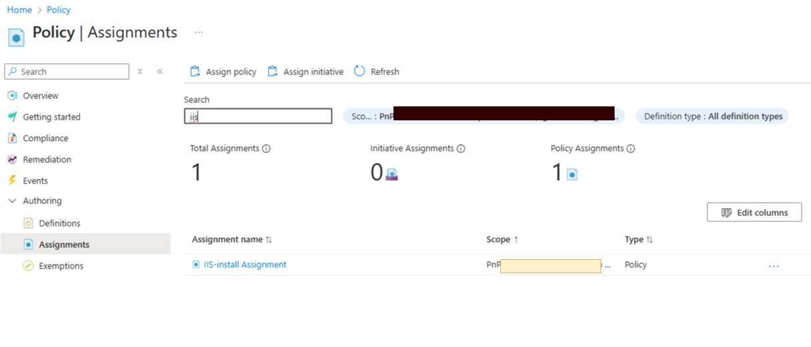
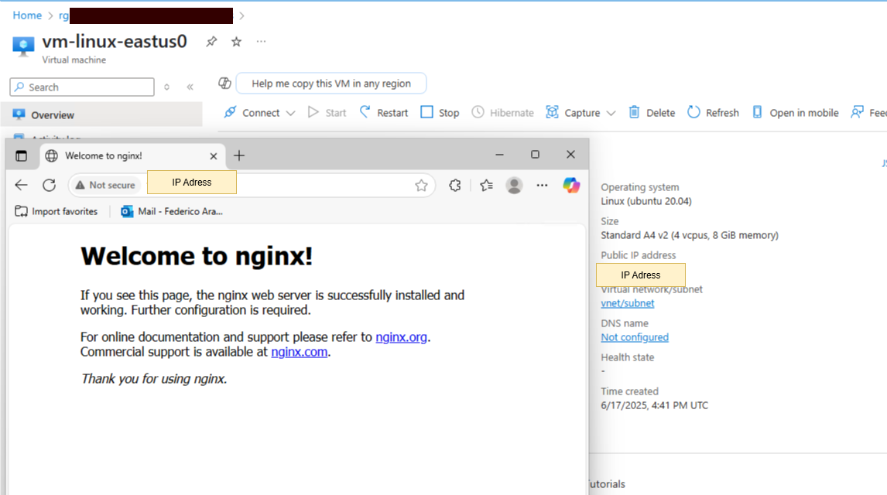

# Azure Machine Configuration

This sample deploys an [Azure Machine Configuration](https://learn.microsoft.com/azure/governance/machine-configuration/) scenario, and it will compile PowerShell Desired State Configuration scripts. Then, the Bicep template deploys 1 to many virtual machines (Windows and Linux), which then uses the compiled configurations to install a webserver on each of the virtual machines.  

Azure Machine Configuration enables you to audit and enforce configuration settings on both Azure and hybrid (Arc-enabled) machines using code. It leverages PowerShell Desired State Configuration (DSC) to define the desired state of a system and ensures compliance through Azure Policy. It supports custom configuration packages and provides detailed compliance reporting through Azure Resource Graph.  

The main difference between Azure Machine Configuration and Azure Automation State Configuration lies in their architecture and integration. Azure Automation State Configuration relies on Azure Automation accounts and DSC pull servers. In contrast, Azure Machine Configuration is fully integrated into Azure Resource Manager and Azure Policy, eliminating the need for separate automation infrastructure. It supports direct assignment of configurations, multiple configurations per machine, and more granular remediation controls. 

## Deploy bases

  Before you begin, ensure you have the Azure Command-Line Interface (CLI) installed. You also need permissions to assign roles at the subscription level.

  Clone this repository:

  ```bash
    git clone https://github.com/mspnp/samples.git
    cd ./samples/solutions/azure-machine-configuration
  ```

### Create a Resource Group

```bash
  az group create --name rg-machine-configuration-eastus --location eastus
```

### Deploy Storage Account and User-Assigned Managed Identities

To deploy a custom guest configuration policy in Azure, you’ll need a Storage Account to host the .zip package containing the compiled .mof file, metadata, and any required DSC resources. This storage location enables Azure Policy to access and distribute the configuration package to target machines.  

Azure Storage access is managed via RBAC. The provided script assigns the necessary roles to the current user to allow file uploads.  

The Bicep template also deploys two User-Assigned Managed Identities:

* Policy VM Identity: Assigned to the virtual machine and policy. It requires Storage Blob Data Reader permissions to download the policy package from the VM.
* Policy Assignment Identity: Used during policy assignment. It must have Contributor and Guest Configuration Resource Contributor roles. We use Resource Group scope.

```bash
  CURRENT_USER_OBJECT_ID=$(az ad signed-in-user show -o tsv --query id)
  STORAGE_ACCOUNT_NAME="stpolices$(LC_ALL=C tr -dc 'a-z0-9' < /dev/urandom | fold -w 7 | head -n 1)"

  az deployment group create --resource-group rg-machine-configuration-eastus --template-file ./bicep/guestConfigInfraSetup.bicep  -p storageAccountName=$STORAGE_ACCOUNT_NAME principalId=$CURRENT_USER_OBJECT_ID

  POLICY_DOWNLOAD_USER_ASSIGNED_IDENTITY=$(az deployment group show --resource-group rg-machine-configuration-eastus --name guestConfigInfraSetup --query "properties.outputs.policyDownloadUserAssignedIdentityId.value" --output tsv)
```

## Azure Policy Creation
Custom policies using Desired State Configuration (DSC) in Azure are built on the **Guest Configuration** framework. This framework enables administrators to define and enforce configuration baselines across both Windows and Linux machines.  

These policies are authored using PowerShell DSC resources and compiled into MOF (Managed Object Format) files. The typical workflow includes:  

1. Defining a DSC resource configuration.
2. Compiling it into a MOF file.
3. Packaging the output into a .zip file.
4. Publishing .zip file on Storage Account
5. Creating Policy Definition based on the published .zip file and a user-assigned managed identity for download access.
6. Assigning to a particular scope.  

Once assigned, **Azure Policy** evaluates the configuration on target machines and reports compliance status.  

### Prerequisites

Before authoring and deploying custom guest configuration policies, ensure the following tools and modules are installed on your system:

* **PowerShell 7** – Required for authoring and compiling Desired State Configuration (DSC) scripts.
* **PSDscResources** – A PowerShell module containing commonly used DSC resources for configuration management.
* **GuestConfiguration** – A PowerShell module that provides cmdlets such as `New-GuestConfigurationPolicy` and `Get-GuestConfigurationPackageComplianceStatus` to create and manage guest configuration packages and policies.
* **Az.Resources** – Azure PowerShell module required for managing Azure Policy resources, including `New-AzPolicyDefinition` and `New-AzPolicyAssignment`.
* **Az.Accounts** – Azure PowerShell module for authentication and context management. Use `Connect-AzAccount` to sign in and `Set-AzContext` to select the appropriate subscription.
* **Nxtools** – An open-source PowerShell module used to compile Linux-based DSC scripts. It provides class-based DSC resources for Linux and includes built-in machine configuration packages for managing users, groups, services, file systems, archives, and packages.

```powershell
# Navigate to the scripts directory
cd scripts
```

### Create MOF Files

This step involves generating **MOF (Managed Object Format)** files from PowerShell DSC scripts for both Linux and Windows environments.  

A MOF file is the compiled output of a PowerShell Desired State Configuration (DSC) script. It defines the desired state of a system in a standardized format that can be interpreted by the Local Configuration Manager (LCM) on a target machine. The LCM uses this file to enforce or audit system settings.  

You can generate the MOF files by running the following scripts:  

```powershell
  ./linux-config.ps1   # Generates ./NginxInstall/localhost.mof
  ./windows-config.ps1 # Generates ./windowsfeatures/localhost.mof
```
Each script compiles its respective configuration and outputs the MOF file into a subdirectory named after the configuration.  

### Package Configuration

Once the MOF files are generated, the next step is to package them into a .zip file containing the MOF, metadata, and any required DSC resources—this is the format that Azure Policy can use.  

The `New-GuestConfigurationPackage` cmdlet is used to create a Guest Configuration package from a compiled .mof file.  

This package includes:  
* The .mof file (defining the desired system state),
* Metadata,
* Any required DSC resources.

From the `scripts` directory, run the following scripts to generate the packages:  

```powershell
  ./linux-package.ps1   # Generates ./NginxInstall.zip
  ./windows-package.ps1 # Generates ./WindowsFeatures.zip
```

The resulting .zip file is ready to be published and assigned as a custom policy in Azure.

### Upload Configuration to Azure Storage

Once the configuration packages (.zip files) are created, they must be uploaded to an Azure Storage Account.

```bash
 az storage blob upload --account-name $STORAGE_ACCOUNT_NAME --container-name azuremachineconfiguration --file ./scripts/NginxInstall.zip --auth-mode login  --overwrite

 az storage blob upload --account-name $STORAGE_ACCOUNT_NAME --container-name azuremachineconfiguration --file ./scripts/WindowsFeatures.zip --auth-mode login  --overwrite
 
# After uploading, you can construct the URLs to reference these packages in your policy definitions:
URL_LX_CONTENT="https://$STORAGE_ACCOUNT_NAME.blob.core.windows.net/azuremachineconfiguration/NginxInstall.zip"
echo $URL_LX_CONTENT

URL_WIN_CONTENT="https://$STORAGE_ACCOUNT_NAME.blob.core.windows.net/azuremachineconfiguration/WindowsFeatures.zip"
echo $URL_WIN_CONTENT
```  

### Generate and Deploy Policies

Before generating the policy definitions, make sure to update the following placeholders in the scripts:  

In linux-policy.ps1, replace:  
* ContentUri with the value of $URL_LX_CONTENT
* ManagedIdentityResourceId with $POLICY_DOWNLOAD_USER_ASSIGNED_IDENTITY  

In windows-policy.ps1, replace:
* ContentUri with the value of $URL_WIN_CONTENT
* ManagedIdentityResourceId with $POLICY_DOWNLOAD_USER_ASSIGNED_IDENTITY  

These values ensure that the policy correctly references the uploaded configuration package and uses the appropriate managed identity for access.  

```powershell
   # Generate Policy Definition
  ./linux-policy.ps1  # Outputs: .\policies\auditIfNotExists\NginxInstall_DeployIfNotExists.json
  ./windows-policy.ps1 # Outputs: .\policies\auditIfNotExists\WindowsFeatures_DeployIfNotExists.json

  # Deploy Policies. Use the Azure CLI to create the policy definitions
  New-AzPolicyDefinition -Name 'nginx-install' -Policy ".\policies\auditIfNotExists\NginxInstall_DeployIfNotExists.json"
  New-AzPolicyDefinition -Name 'IIS-install' -Policy ".\policies\auditIfNotExists\WindowsFeatures_DeployIfNotExists.json"
```
These commands register the custom policies in your Azure environment, making them available for assignment to resource scopes such as subscriptions or resource groups.  

### Assign Policies

Once the policy definitions are created, the next step is to assign them to a scope —typically a resource group— so they can evaluate and enforce configuration compliance on virtual machines.  

In this example, we assign the policies to all virtual machines within the resource group rg-machine-configuration-eastus.  

The User-Assigned Managed Identity used in the policy assignment must have the following roles:  

* Guest Configuration Resource Contributor (required):
  * Write guest configuration assignments.
  * Read and report compliance data from virtual machines.
  * Deploy the Guest Configuration extension if needed.
* Contributor (optional but common):
  Grants broader permissions, including the ability to create and manage resources. This may be necessary depending on the policy’s behavior.

> ⚠️ **Warning:** Without the proper roles, the policy assignment may succeed, but the guest configuration will not be enforced or reported correctly.

```powershell
$ResourceGroup = Get-AzResourceGroup -Name rg-machine-configuration-eastus
$UserAssignedIdentity = Get-AzUserAssignedIdentity -ResourceGroupName rg-machine-configuration-eastus -Name 'id-policy-assigment-eastus'

$policyDefinitionNginxInstall = Get-AzPolicyDefinition -Name 'nginx-install'
New-AzPolicyAssignment -Name 'nginx-install-assigment' -DisplayName "nginx-install Assignment" -Scope $ResourceGroup.ResourceId  -PolicyDefinition $policyDefinitionNginxInstall -Location 'eastus' -IdentityType 'UserAssigned' -IdentityId $UserAssignedIdentity.Id

$policyDefinitionWin = Get-AzPolicyDefinition -Name 'IIS-install'
New-AzPolicyAssignment -Name 'IIS-install-assigment' -DisplayName "IIS-install Assignment" -Scope $ResourceGroup.ResourceId  -PolicyDefinition $policyDefinitionWin -Location 'eastus' -IdentityType 'UserAssigned' -IdentityId $UserAssignedIdentity.Id

# Go back to root folder
cd ..
```

## Deploy Sample

Run the following command to deploy the sample virtual machines and apply the machine configuration policies. You can customize the number of virtual machines by modifying the windowsVMCount and linuxVMCount parameters in the Bicep template.  

To apply policies using Azure Machine Configuration, each virtual machine must meet the following requirements:  
* Guest Configuration extension must be installed.
* System-assigned managed identity must be enabled to allow secure authentication with the configuration service.
* The VM must be assigned the user-assigned managed identity used in the policy, which must have the Storage Blob Data Reader role. This allows the VM to download the Desired State Configuration (DSC) package from Azure Storage.

```bash
az deployment group create --resource-group rg-machine-configuration-eastus -f ./bicep/main.bicep -p policyUserAssignedIdentityId=$POLICY_DOWNLOAD_USER_ASSIGNED_IDENTITY
```

To query policy compliance data using Azure Resource Graph, the identity executing the query must have the Reader role assigned at the subscription level. This is because Azure Resource Graph aggregates and exposes resource and compliance information across the entire subscription, and accessing this data requires read permissions. Assigning the Reader role ensures the identity can retrieve policy states, compliance results, and other metadata necessary for auditing and reporting, without granting permissions to modify resources.
The Bicep template defines an alert based on an Azure Graph Resource query. In order to execute that query, it needs to have the Reader role at the subscription level.

```bash
ALERT_SYSTEM_OBJECT_ID=$(az deployment group show --resource-group rg-machine-configuration-eastus --name main --query "properties.outputs.alertSystemObjectId.value" --output tsv)
SUBSCRIPTION_ID=$(az account show --query id -o tsv)
az role assignment create --assignee $ALERT_SYSTEM_OBJECT_ID --role Reader --scope /subscriptions/$SUBSCRIPTION_ID
```

## Create Remediation Tasks

After assigning the policies, you can create remediation tasks to proactively trigger policy compliance evaluation and remediation on existing resources. Remediation tasks help ensure that non-compliant resources are brought into compliance more quickly, rather than waiting for the next scheduled policy evaluation cycle.

To create remediation tasks for the two policy assignments, use the following commands:

```powershell
# Get the policy assignments
$nginxPolicyAssignment = Get-AzPolicyAssignment -Name 'nginx-install-assigment' -Scope $ResourceGroup.ResourceId
$windowsPolicyAssignment = Get-AzPolicyAssignment -Name 'IIS-install-assigment' -Scope $ResourceGroup.ResourceId

# Create remediation tasks for each policy assignment
Start-AzPolicyRemediation -Name 'nginx-remediation' -PolicyAssignmentId $nginxPolicyAssignment.Id -ResourceGroupName 'rg-machine-configuration-eastus'
Start-AzPolicyRemediation -Name 'iis-remediation' -PolicyAssignmentId $windowsPolicyAssignment.Id -ResourceGroupName 'rg-machine-configuration-eastus'
```

Remediation tasks instruct Azure Policy to immediately scan the targeted resources and, if necessary, deploy the Guest Configuration extension or apply the configuration package to bring resources into compliance. This accelerates the application of your policies, ensuring that configuration changes are enforced without delay.

## Check Policy downloaded

To verify that the guest configuration policy has been successfully downloaded and applied, you can inspect the virtual machine using Azure Bastion, which is deployed as part of this solution. Use Azure Bastion to securely connect to the virtual machine without exposing public IPs.

Here is where the [client Guest Configuration log](https://learn.microsoft.com/azure/governance/machine-configuration/overview#client-log-files) files are located for more details.  

Within the GuestConfig/Configuration folder, you should find the downloaded policies.   

## Monitoring 

Azure provides built-in visibility into policy compliance at both the virtual machine and policy levels, enabling you to track and manage configuration adherence effectively.  

Each virtual machine displays the Azure Policies applied to it, along with its current compliance status. This allows you to verify whether the guest configuration has been successfully enforced. The policies could take some time to be evaluated and remediated.  

  
  

You can also view the overall compliance status from the Azure Policy blade. This view provides a summary of all policy definitions and their assignments, helping you assess compliance across your environment. 

  

You can inspect the details of your custom policy definitions and their corresponding assignments.

   
  

Once compliance is confirmed, you can test the result by accessing the virtual machine using its public IP address—for example, by opening a browser and navigating to the expected service endpoint. 

  
  

If compliance is not detected, an alert will be raised and you will receive an email. 

  

### Querying Policy Compliance with Azure Resource Graph

Azure Policy compliance data can be queried using [Azure Resource Graph](https://learn.microsoft.com/azure/governance/policy/samples/resource-graph-samples), which enables you to explore and analyze policy states at scale across your environment. The [Resource Graph Explorer](https://learn.microsoft.com/azure/governance/resource-graph/first-query-portal) in the Azure portal provides an interactive interface to run Kusto Query Language (KQL) queries against your Azure resources, including policy assignments, compliance results, and non-compliant resources. This allows you to quickly identify compliance issues, generate reports, and gain insights into your policy landscape.

When creating alerts based on Resource Graph queries, it's important to note that these alerts are managed through a Log Analytics workspace. To run Resource Graph queries from within a Log Analytics workspace, you must use the `arg("")` function. This function allows you to embed an Azure Resource Graph query inside the Log Analytics query editor, enabling cross-resource querying and integration with Azure Monitor alerts. Without `arg("")`, the Log Analytics workspace cannot directly access Resource Graph data. Therefore, to create an alert that monitors policy compliance using Resource Graph, you need to have a Log Analytics workspace and structure your query using `arg("")` to retrieve the relevant compliance information.

For example, in the Log Analytics workspace query editor, you can use:

```kusto
  arg("").PolicyResources
  | where resourceGroup == 'rg-machine-configuration-eastus'
  | where type == 'microsoft.policyinsights/policystates'
  | extend complianceState = properties.complianceState
  | extend policyAssignmentName = properties.policyAssignmentName
  | where policyAssignmentName == 'nginx-install-assigment' or policyAssignmentName == 'IIS-install-assigment'
  | extend resourceId = properties.resourceId
  | project policyAssignmentName, complianceState, resourceId
```
You can also create alerts based on Resource Graph queries to proactively monitor policy compliance. By following the guidance in [Resource Graph alert samples](https://learn.microsoft.com/azure/governance/resource-graph/samples/alerts-samples), you can define a query that identifies non-compliant resources and configure an Azure Monitor alert to trigger when the query returns results. This enables automated notifications or remediation actions whenever policy violations are detected, helping you maintain compliance and respond quickly to configuration drift.

## Solution deployment parameters

| Parameter | Type | Description | Default |
|---|---|---|--|
| adminUserName | string | If deploying virtual machines, the admin user name. | admin-user |
| adminPassword | securestring | If deploying virtual machines, the admin password. | (must be provided at deployment) |
| windowsVMCount | int | Number of Windows virtual machines to create in spoke network. | 1 |
| linuxVMCount | int | Number of Linux virtual machines to create in spoke network. | 1 |
| vmSize | string | Size for the Windows and Linux virtual machines. | Standard_A4_v2 |
| location | string | Deployment location. | (Resolved at deployment: `resourceGroup().location`) |

## Clean Up

Once you're done testing or demonstrating the solution, you can remove all deployed resources to avoid unnecessary costs and maintain a clean environment.

```bash
# This command deletes the entire resource group and all associated resources, including virtual machines, identities, storage accounts, and Azure Bastion
az group delete -n rg-machine-configuration-eastus  -y

# Remove the custom policy definitions created for the guest configuration
az policy definition delete --name nginx-install
az policy definition delete --name IIS-install

```

## Microsoft Open Source Code of Conduct

This project has adopted the [Microsoft Open Source Code of Conduct](https://opensource.microsoft.com/codeofconduct/).

Resources:

- [Microsoft Open Source Code of Conduct](https://opensource.microsoft.com/codeofconduct/)
- [Microsoft Code of Conduct FAQ](https://opensource.microsoft.com/codeofconduct/faq/)
- Contact [opencode@microsoft.com](mailto:opencode@microsoft.com) with questions or concerns
