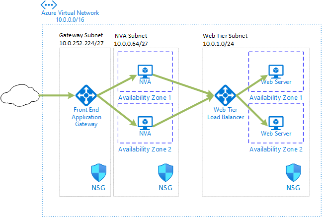
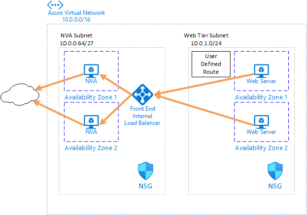
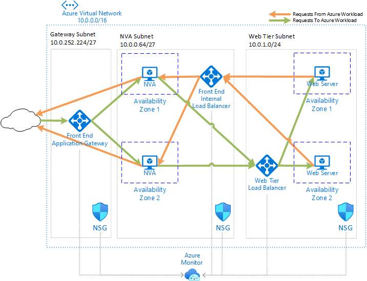

# Highly Available Ingress/Egress with layer 7 NVAs

## Overview

This sample template can be used to deploy several configurations of simulated Layer 7 NVAs to demonstrate a highly available configuration. For more information on this deployment and other highly available NVA options, see [Deploy highly available NVAs](https://docs.microsoft.com/azure/architecture/reference-architectures/dmz/nva-ha).

**Ingress-only** - Deploy an Azure Application Gateway in front of two simulated network virtual appliance (NVA) VMs.  The NVA VMs will forward requests on port 80 to a web-tier Azure Load Balancer, which will distribute traffic across two back-end VMs running a simple web server.



**Egress-only** - Deploy an internal Azure Load Balancer in front of two simulated network virtual appliance (NVA) VMs.  The NVA VMs will proxy requests on port 8080 from web-tier VMs to the Internet.



**Ingress-Egress** - Combines the above two options to provide highly available Layer 7 NVA-controlled traffic for both the Ingress path to the web-tier, and the Egress path from the web-tier.



## Deploy this template to Azure

> Note: If you fork this repository, you will need to modify the deployment links in [README.md](README.md) to point to your repo.  If you create a separate branch for testing, you will have to include a change to this link to point to your branch as well. You must include a URL-encoded link to the raw [azuredeploy.json](azuredeploy.json) file after `/uri/` in the link defined for the deployment button, or you can point to your repo with the `--template-uri`/`-TemplateUri` parameter of the CLI or Powershell commands.

### Azure portal

Use the following buttons to deploy the architecture using the Azure portal.

[](https://portal.azure.com/#create/Microsoft.Template/uri/https%3A%2F%2Fraw.githubusercontent.com%2Fmspnp%2Fsamples%2Fmaster%2Fsolutions%2Fha-nva%2Fazuredeploy.json)
[](https://portal.azure.us/#create/Microsoft.Template/uri/https%3A%2F%2Fraw.githubusercontent.com%2Fmspnp%2Fsamples%2Fmaster%2Fsolutions%2Fha-nva%2Fazuredeploy.json)

To deploy the **ingress-only** configuration, set the values of the following parameters:

    deployIngressAppGatewayWebLoadBalancer=true
    deployEgressLoadBalancerNva=false

To deploy the **egress-only** configuration, set the values of the following parameters:

    deployIngressAppGatewayWebLoadBalancer=false
    deployEgressLoadBalancerNva=true

To deploy the **ingress-egress** configuration, set the values of the following parameters:

    deployIngressAppGatewayWebLoadBalancer=true
    deployEgressLoadBalancerNva=true

### Azure CLI

Use the following command to create a resource group for the deployment.

```azurecli-interactive
az group create --name ha-nva-l7 --location eastus
```

Run one of the following commands to deploy the example architecture.

#### For ingress-only

```azurecli-interactive
az deployment group create --resource-group ha-nva-l7 \
    --template-uri https://raw.githubusercontent.com/mspnp/samples/master/solutions/ha-nva/azuredeploy.json \
    --parameters deployIngressAppGatewayWebLoadBalancer=true deployEgressLoadBalancerNva=false
```

#### For egress-only

```azurecli-interactive
az deployment group create --resource-group ha-nva-l7 \
    --template-uri https://raw.githubusercontent.com/mspnp/samples/master/solutions/ha-nva/azuredeploy.json \
    --parameters deployIngressAppGatewayWebLoadBalancer=false deployEgressLoadBalancerNva=true
```

#### For ingress-egress

```azurecli-interactive
az deployment group create --resource-group ha-nva-l7 \
    --template-uri https://raw.githubusercontent.com/mspnp/samples/master/solutions/ha-nva/azuredeploy.json
```

### PowerShell

Use the following command to create a resource group for the deployment.

```azurepowershell-interactive
New-AzResourceGroup -Name ha-nva-l7 -Location eastus
```

Run one of the following commands to deploy the example architecture.

#### For ingress-only

```azurepowershell-interactive
New-AzResourceGroupDeployment -ResourceGroupName ha-nva-l7 `
    -TemplateUri https://raw.githubusercontent.com/mspnp/samples/master/solutions/ha-nva/azuredeploy.json `
    -deployIngressAppGatewayWebLoadBalancer $true -deployEgressLoadBalancerNva $false
```

#### For egress-only

```azurepowershell-interactive
New-AzResourceGroupDeployment -ResourceGroupName ha-nva-l7 `
    -TemplateUri https://raw.githubusercontent.com/mspnp/samples/master/solutions/ha-nva/azuredeploy.json `
    -deployIngressAppGatewayWebLoadBalancer $false -deployEgressLoadBalancerNva $true
```

#### For ingress-egress

```azurepowershell-interactive
New-AzResourceGroupDeployment -ResourceGroupName ha-nva-l7 `
    -TemplateUri https://raw.githubusercontent.com/mspnp/samples/master/solutions/ha-nva/azuredeploy.json
```

### Redeploying the architecture to the same Resource Group

If you redeploy this template to the same Resource Group, you must specify the same admin user name.  If you do not remember the admin user name, you should first delete the VM resources so that they can be recreated. Azure does not allow redeployment of VMs that change the `linuxConfiguration.ssh.publicKeys` property and a change to the user name will cause a conflict.

### Redeploying the architecture using the same Resource Group Name

If you are redeploying the template using the same Resource Group name after deleting the Resource Group or deployed resources, you may need to purge the previously created Azure Key Vault.  Azure requires globally unique names for Key Vault resources and this template will generate a unique name based on your subscription and Resource Group. Key Vault implements a soft-delete feature which is enabled by default. If you want to deploy the template to a Resource Group of the same name, you will have to purge the previous instance of the Key Vault following the instructions at [List, recover, or purge a soft-deleted key vault](https://docs.microsoft.com/azure/key-vault/general/key-vault-recovery#list-recover-or-purge-a-soft-deleted-key-vault).  For testing purposes, you may pass in a `false` value for the template parameter `keyVaultEnableSoftDelete`, but this may cease to work in the future.

### Solution deployment parameters

| Parameter | Type | Description | Default |
|---|---|---|--|
|location|string|The Azure Region to use|[resourceGroup().location]|
|availabilityZoneCount|int|The number of Availability Zones to use|2|
|virtualNetworkName|String|Name of the VNET for all resources|vnet-hanva|
|vnetPrefix|String|CIDR address space definition for VNet|10.0.0.0/16|
|nvaSubnetPrefix|String|CIDR address prefix definition for NVA subnet|10.0.0.64/27|
|webSubnetPrefix|String|CIDR address prefix definition for web subnet|10.0.1.0/24|
|appGatewaySubnetPrefix|String|CIDR address prefix definition for AppGateway subnet|10.0.252.224/27|
|bastionSubnetPrefix|String|CIDR address prefix definition for Bastion subnet|10.0.253.224/27|
|gatewaySubnetPrefix|String|CIDR address prefix definition for Gateway subnet|10.0.255.224/27|
|operatingSystemImage|string|OS Image to use for all VMs|CentOS 7 (latest, LVM)|
|adminUserForVMAccess|String|Admin User for all VMs|null|
|nvaNetworkSecurityGroupName|String|Name of the Network Security Group for the NVA resources|nsg-nva|
|nvaVMNameBase|String|Prefix for naming NVA VMs|vm-nva|
|nvaVMCount|Int|How many NVA VMs to provision|2|
|nvaVMSize|String|VM size for NVA VMs|Standard_D2s_v3|
|webNetworkSecurityGroupName|String|Name of the Network Security Group for the web resources|nsg-web|
|webVMNameBase|String|Prefix for naming web VMs|vm-web|
|webVMCount|Int|How many web VMs to provision|2|
|webVMSize|String|VM size for NVA VMs|Standard_D2s_v3|
|gatewayNetworkSecurityGroupName|String|Name of the Network Security Group for the gateway resources|nsg-gateway|
|allowConnectionFromIPOrCIDRBlock|string|Default value of 0.0.0.0/0 allows management and connections from the entire Internet|0.0.0.0/0|
|deployAzureBastion|bool|Selection to deploy Azure Bastion|true|
|deployIngressAppGatewayWebLoadBalancer|bool|Selection to deploy the Azure Application Gateway for the NVA VMs and Azure Load Balancer for the web VMs|true|
|deployEgressLoadBalancerNva|bool|Selection to deploy Azure Load Balancer for the NVA VMs|true|
|keyVaultEnableSoftDelete|bool|Enable delete protection (soft delete) for Key Vault (should always be enabled for production environments)|true|
|_artifactsLocation|string|The base URI where artifacts required by this template are located including a trailing '/' or `deployment().properties.template.uri` to use detected deployment root location|[deployment().properties.templateLink.uri]|
|_artifactsLocationSasToken|securestring|The sasToken required to access _artifactsLocation||

## Architecture details

This deployment will set up a simulated environment representing the architectures above.  Clients from the Internet will reach the application via the Public IP on the Application Gateway.  The Application Gateway will forward the request to one of the available deployed NVA VMs. In a real deployment, the NVA VMs may perform other analysis, but for this sample they just forward the request to the web-tier Load Balancer.  The web-tier Load Balancer will forward the request to one of the available web VMs.

For any outbound traffic from the web-tier VMs, they will use the locally configured `http_proxy` environment variable to direct http/https traffic to the internal NVA load balancer, which is configured as a forwarding proxy.

### Simulated NVA VMs

The simulated NVA VMs for this sample are CentOS 7 or RedHat 7 virtual machines running Apache httpd configured as a forward proxy on port 8080 to handle requests from the web-tier, and a reverse proxy to forward all requests on port 80 to the back end Load Balancer IP address (10.0.1.4). The script to set up the proxy is at: [scripts/simpleproxy.sh](scripts/simpleproxy.sh).

### Simulated Web VMs

The simulated web VMs for this sample are CentOS 7 or RedHat 7 virtual machines running Apache httpd with an index.html file generated to include the VM instance name from the Azure Instance Metadata Service. The script to set up the web server is at: [scripts/simpleweb.sh](scripts/simpleweb.sh).

## Connecting to the web endpoint

To test the ingress path, find the public IP address of the Application Gateway (ag-hanva) and enter it in the address bar of your web browser.  You should see a simple page indicating which back-end web server is providing the response. You can stop any of the NVA or web VMs, and the endpoint solution should automatically route requests through and to available VMs.

## Connecting to deployed VMs with Azure Bastion

An Azure Bastion service is deployed to provide access to the VMs in this architecture. The SSH Key required to connect to the VMs is generated at deployment time and stored in Azure Key Vault using the nested deployment script [nested/storekeyinkeyvault.json](nested/storekeyinkeyvault.json), which was adapted from [Create ssh-keys and store in Key Vault](https://azure.microsoft.com/resources/templates/201-deployment-script-ssh-key-gen/).

In order to access the ssh key from the portal to use Azure Bastion, you will need to add an access policy on the Key Vault and grant yourself ***Secret*** **List** and **Get** permissions on `kv-hanva-{uniquestring}`.

To test the egress path, connect to one of the web-tier VMs using Azure Bastion as described above. You can use a curl command like the following to confirm the egress path is working properly:

```bash
curl -v https://ifconfig.me
```

The output should show the connection to the internal NVA loadbalancer as well as the public IP address that is used to connect to the internet.  See the example below:

```
* About to connect() to proxy 10.0.0.68 port 8080 (#0) # Confirm proxy address is private IP of NVA Load Balancer
*   Trying 10.0.0.68...
* Connected to 10.0.0.68 (10.0.0.68) port 8080 (#0)
> GET http://ifconfig.me/ HTTP/1.1
> User-Agent: curl/7.29.0
> Host: ifconfig.me
> Accept: */*
...
< Via: 1.1 vm-nva-1.internal.cloudapp.net:8080 # Shows which NVA VM serviced the request
<
* Connection #0 to host 10.0.0.68 left intact
203.0.113.34 # Should be the Public IP of the NVA VM
```

## Considerations

### Cost Optimization

The primary drivers of cost in this example architecture are Compute, Load Balancers, the Application Gateway, and storage associated with Azure Monitor.

### Operational Excellence

All resources are currently configured to send all available logs and metrics to the provisioned Azure Monitor workspace. This allows visibility into the performance of all resources and provides the ability to generate alerts for abnormal functioning of the system.

### Performance Efficiency

The sample architecture demonstrates the ability to provision a number of like-functioning VMs across multiple Azure Availability Zones. Larger numbers of VMs can be provisioned based on the throughput requirements of the web tier workload, or the performance requirements of the NVA VMs.

### Reliability

This sample architecture shows how to incorporate Azure Application Gateways and Load Balancers with Network Virtual Appliances running on VMs in a Zone-aware fashion to provide resiliency against fault domain related failures.

### Security

Inbound traffic is restricted to expected traffic for all resources using three Network Security Groups.  In the egress and ingress-egress configurations, outbound traffic from the web tier is also restricted to only allow egress via the layer-7 http/https proxy that is running on the NVA VMs.

The SSH key needed to log into all VMs is stored in Azure Key Vault. In order to use Azure Bastion to connect to the VMs, you must grant the user access to LIST and GET secrets in the Key Vault.  This example uses an empty passphrase on the SSH key, relying on Key Vault RBAC to control access to the secret.

Access to the VMs in the NVA and Web subnets is only achieved through Azure Bastion.

## Acknowledgements

These sample architectures leverage concepts from the [Example Parameterized Deployment With Linked Templates](https://azure.microsoft.com/resources/templates/301-parameterized-linked-templates/) and [Create ssh-keys and store in Key Vault](https://azure.microsoft.com/resources/templates/201-deployment-script-ssh-key-gen/) samples.

## Code of conduct

This project has adopted the [Microsoft Open Source Code of Conduct](https://opensource.microsoft.com/codeofconduct/). For more information, see the [Code of Conduct FAQ](https://opensource.microsoft.com/codeofconduct/faq/) or contact [opencode@microsoft.com](mailto:opencode@microsoft.com) with any additional questions or comments.
