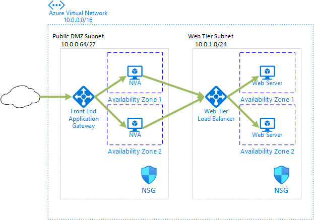

# Highly Available Ingress with layer 7 NVAs

This sample template will deploy an Azure Application Gateway in front of two simulated network virtual appliance (NVA) VMs.  The NVA VMs will forward requests on port 80 to a Web-tier Azure Load Balancer, which will distribute traffic across two back-end VMs running a simple web server.

For more information on this deployment and other highly available NVA options, see [Deploy highly available NVAs](https://docs.microsoft.com/azure/architecture/reference-architectures/dmz/nva-ha).



This sample architecture leverages concepts from the [Example Parameterized Deployment With Linked Templates](https://azure.microsoft.com/resources/templates/301-parameterized-linked-templates/) and [Create ssh-keys and store in Key Vault](https://azure.microsoft.com/resources/templates/201-deployment-script-ssh-key-gen/) samples.

## Deploy this template to Azure

*Note: If you fork this repository, you will need to modify the link in [README.md](README.md) to point to your repo.  If you create a separate branch for testing, you will have to include a change to this link to point to your branch as well. You must include a URL-encoded link to the raw [azuredeploy.json](azuredeploy.json) file after `/uri/` in the link defined for the deployment button. You should also change the default value of `_artifactsLocation`.*

#### Azure portal

Use the following buttons to deploy the architecture using the Azure portal or to visualize with [armviz.io](https://armviz.io).

[](https://portal.azure.com/#create/Microsoft.Template/uri/https%3A%2F%2Fraw.githubusercontent.com%2Fmspnp%2Fsamples%2Fmaster%2Fsolutions%2Fha-nva%2Flayer-7-ingress%2Fazuredeploy.json)
[](https://portal.azure.us/#create/Microsoft.Template/uri/https%3A%2F%2Fraw.githubusercontent.com%2Fmspnp%2Fsamples%2Fmaster%2Fsolutions%2Fha-nva%2Flayer-7-ingress%2Fazuredeploy.json)
[](http://armviz.io/#/?load=https%3A%2F%2Fraw.githubusercontent.com%2Fmspnp%2Fsamples%2Fmaster%2Fsolutions%2Fha-nva%2Flayer-7-ingress%2Fazuredeploy.json)

#### Azure CLI

Use the following command to create a resource group for the deployment.

```bash
az group create --name ha-nva-l7i --location eastus
```

Run the following command to deploy the Layer 7 Ingress example architecture.

```bash
az deployment group create --resource-group ha-nva-l7i \
    --template-uri https://raw.githubusercontent.com/mspnp/samples/master/solutions/ha-nva/layer-7-ingress/azuredeploy.json
```

#### PowerShell

Use the following command to create a resource group for the deployment.

```powershell
New-AzResourceGroup -Name ha-nva-l7i -Location eastus
```

Run the following command to deploy the Layer 7 Ingress example architecture.

```powershell
New-AzResourceGroupDeployment -ResourceGroupName ha-nva-l7i `
    -TemplateUri https://raw.githubusercontent.com/mspnp/samples/master/solutions/ha-nva/layer-7-ingress/azuredeploy.json
```

#### Redeploying the architecture to the same Resource Group or Resource Group name

You cannot redeploy this template to the same Resource Group without first deleting the NVA and web VM resources. The deployment script that generates the SSH key will generate a new key with each deployment and Azure does not allow redeployment of VMs that change the `linuxConfiguration.ssh.publicKeys` property.

If you are redeploying the template using the same Resource Group name, you will need to purge the previously created Azure Key Vault.  Azure requires globally unique names for Key Vault resources and this template will generate a unique name based on your subscription and Resource Group. Additionally Key Vault implements a soft-delete feature which is enabled by default. If you want to deploy the template to a Resource Group of the same name, you will have to purge the previous instance of the Key Vault following the instructions at [List, recover, or purge a soft-deleted key vault](https://docs.microsoft.com/azure/key-vault/general/key-vault-recovery#list-recover-or-purge-a-soft-deleted-key-vault).

### Solution deployment parameters

| Parameter | Type | Description | Default |
|---|---|---|--|
|location|string|The Azure Region to Use|[resourceGroup().location]|
|AvailabilityZoneCount|int|The number of Availability Zones to Use|2|
|VirtualNetworkName|String|Name of the VNET for all Resources|vnet-hanva|
|OperatingSystemImage|string|OS Image to use for All VMs|CentOS 7 (latest, LVM)|
|AdminUserForVMAccess|String|Admin User for all VMs|null|
|PassphraseForSshKey|securestring|Passphrase to access SSH Key (New key will be stored in Key Vault)|null|
|NvaNetworkSecurityGroupName|String|Name of the Network Security Group for the NVA Resources|nsg-NVA|
|NvaVMNameBase|String|Prefix for naming NVA VMs|vm-nva|
|NvaVMCount|Int|How many NVA VMs to provision|2|
|NvaVMSize|String|VM Size for NVA VMs|Standard_D2s_v3|
|WebNetworkSecurityGroupName|String|Name of the Network Security Group for the Web Resources|nsg-Web|
|WebVMNameBase|String|Prefix for naming Web VMs|vm-web|
|WebVMCount|Int|How many Web VMs to provision|2|
|WebVMSize|String|VM Size for NVA VMs|Standard_D2s_v3|
|DmzNetworkSecurityGroupName|String|Name of the Network Security Group for the Dmz Resources|nsg-DMZ|
|AllowDmzConnectionFromIPOrCIDRBlock|string|Default value of 0.0.0.0/0 allows management and connections from the entire Internet|0.0.0.0/0|
|DeployAzureBastionDmz|String|Selection to deploy Azure Bastion|Yes|
|DeployAppGatewayDmz|String|Selection to deploy Azure Application Gateway for the Dmz|Yes|
|DeployLoadBalancerWeb|String|Selection to deploy Azure Application Gateway for the Web|Yes|
|_artifactsLocation|string|The base URI where artifacts required by this template are located including a trailing '/'|[https://raw.githubusercontent.com/...](https://raw.githubusercontent.com/mspnp/samples/master/solutions/ha-nva/layer-7-ingress/)|
|_artifactsLocationSasToken|securestring|The sasToken required to access _artifactsLocation||

## Architecture details

This deployment will set up a simulated environment representing the architecture above.  Clients from the Internet will reach the application via the Public IP on the Application Gateway.  The Application Gateway will forward the request to one of the available deployed NVA VMs. In a real deployment, the NVA VMs may perform other analysis, but for this sample they just forward the request to the erb tier Load Balancer.  The web tier Load Balancer will forward the request to one of the available web VMs.

### Simulated NVA VMs

The simulated NVA VMs for this sample are CentOS 7 or RedHat 7 virtual machines running Apache httpd configured as a reverse proxy to forward all requests to the back end Load Balancer IP address (10.0.1.4). The script to set up the reverse proxy is at: [scripts/simpleproxy.sh](scripts/simpleproxy.sh).

### Simulated Web VMs

The simulated web VMs for this sample are CentOS 7 or RedHat 7 virtual machines running Apache httpd with an index.html file generated to include the VM instance name from the Azure Instance Metadata Service. The script to set up the web server is at: [scripts/simpleweb.sh](scripts/simpleweb.sh).

## Connecting to the web endpoint

To test the deployment, find the public IP address of the Application Gateway (ag-dmz) and enter it in the address bar of your web browser.  You should see a simple page indicating which back-end web server is providing the response. You can stop any of the NVA or web VMs, and the endpoint solution should automatically route requests through and to available VMs.

## Connecting to deployed VMs with Azure Bastion

An Azure Bastion service is deployed to provide access to the VMs in this architecture. The SSH Key required to connect to the VMs is generated at deployment time and stored in Azure Key Vault using the nested deployment script [nested/storekeyinkeyvault.json](nested/storekeyinkeyvault.json), which was adapted from [Create ssh-keys and store in Key Vault](https://azure.microsoft.com/resources/templates/201-deployment-script-ssh-key-gen/).

In order to access the ssh key from the portal to use Azure Bastion, you will need to add an access policy on the Key Vault and grant yourself ***Secret*** **List** and **Get** permissions on `kv-hanva-{uniquestring}`.

> Note: When connecting to VMs using Azure Bastion from the Azure Portal, you will need to click *Advanced* and enter the SSH Key passphrase that you entered when deploying the solution.
