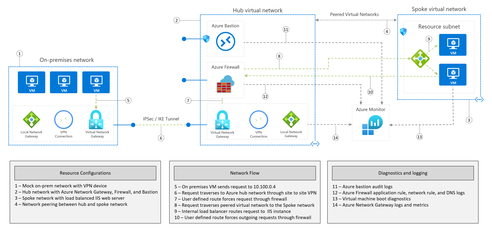

# Basic web app deployment

[](https://nepeters-devops.visualstudio.com/arm-template-validation-pipelines/_build/latest?definitionId=131&branchName=master)

This sample deploys Azure virtual networks in a hub and spoke configuration. An Azure Firewall and Bastion host are also deployed. Optionally, a VPN gateway and sample workload (virtual machines) can be deployed. 

Where applicable, each resource is configured to send diagnostics to an Azure Log Analytics instance.



For detailed information, see the Implement a secure hybrid network:

> [!div class="nextstepaction"]
> [Implement a secure hybrid network](https://review.docs.microsoft.com/azure/architecture/reference-architectures/dmz/secure-vnet-dmz?branch=pr-en-us-2518&tabs=cli)

## Deploy sample

Run the following command to initiate the deployment. When prompted, enter values for an admin user name and password. These values are used to log into the included virtual machines.

```azurecli-interactive
az deployment sub create \
    --template-uri https://raw.githubusercontent.com/neilpeterson/samples/site-to-site-demo/solutions/secure-hybrid-network/azuredeploy.json \
    --location eastus --parameters mocOnPremResourceGroup=site-to-site-mock-prem azureNetworkResourceGroup=site-to-site-azure-network
```

## Solution deployment parameters

| Parameter | Type | Description | Default |
|---|---|---|--|
| adminUserName | string | The admin user name for the Azure SQL instance. | azureadmin |
| adminPassword | securestring | The admin password for the Azure SQL instance. | null |
| mocOnPremResourceGroup | string | Name of the moc on-prem resource group. | |
| azureNetworkResourceGroup | string | Name of the azurre network resource group. | |

## Code of conduct

This project has adopted the [Microsoft Open Source Code of Conduct](https://opensource.microsoft.com/codeofconduct/). For more information, see the [Code of Conduct FAQ](https://opensource.microsoft.com/codeofconduct/faq/) or contact [opencode@microsoft.com](mailto:opencode@microsoft.com) with any additional questions or comments.
